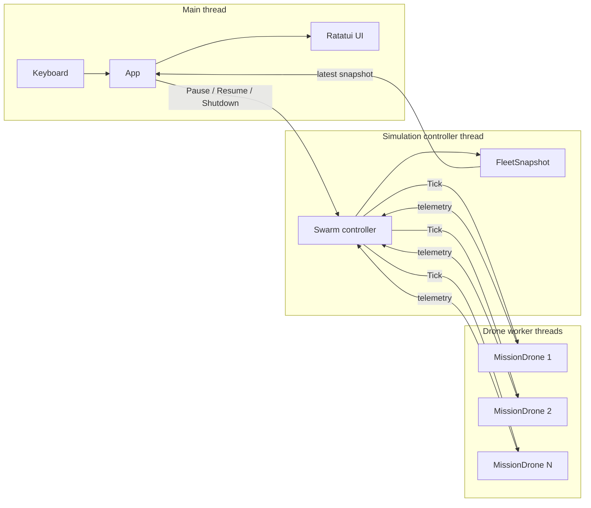
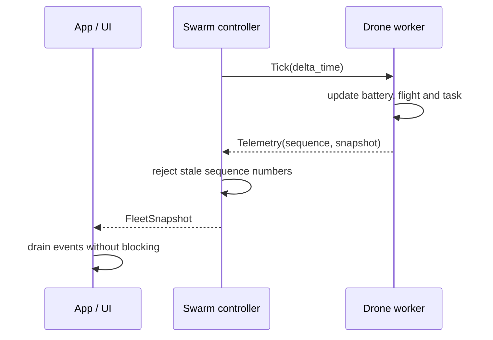

<div align="center">

```text
 █████╗ ███████╗██████╗ ██╗███████╗
██╔══██╗██╔════╝██╔══██╗██║██╔════╝
███████║█████╗  ██████╔╝██║███████╗
██╔══██║██╔══╝  ██╔══██╗██║╚════██║
██║  ██║███████╗██║  ██║██║███████║
╚═╝  ╚═╝╚══════╝╚═╝  ╚═╝╚═╝╚══════╝
```

A terminal simulator for coordinating autonomous drone missions.

</div>

## Why Aeris exists

I built Aeris to get hands-on with the parts of Rust that become interesting once a program has more than one owner of time: threads, bounded channels, state snapshots, graceful shutdown, and failures that should not bring down the rest of the system.

It is deliberately a simulator rather than a flight controller. No hardware is involved. A mission comes from TOML, each drone executes its own task queue, and the terminal UI shows the fleet changing in real time.

## Try it

You need a terminal and a stable Rust toolchain with Rust 2024 edition support.

```bash
cargo run --release
```

Choose a mission with <kbd>↑</kbd>/<kbd>↓</kbd> and press <kbd>Enter</kbd>.

| Key | Start screen | Running mission |
|---|---|---|
| <kbd>↑</kbd> / <kbd>↓</kbd> | Select mission | Select drone |
| <kbd>Enter</kbd> | Start mission | — |
| <kbd>Space</kbd> | — | Pause or resume |
| <kbd>Esc</kbd> | — | Return to mission selection |
| <kbd>Q</kbd> | Quit | Stop workers and quit |

The included scenarios are small on purpose:

- **Recon Alpha** runs two drone groups through a reconnaissance route.
- **Fault Injection** stops one drone while the rest of the fleet keeps moving.
- **Long Patrol** represents roughly five minutes of simulated flight.

<details open>
<summary><strong>What happens after a mission starts?</strong></summary>



The UI never receives mutable drones. It only keeps the latest `FleetSnapshot`. The controller owns the worker handles, and each worker exclusively owns one `MissionDrone` with its drone and task progress.

</details>

<details>
<summary><strong>One simulation tick, step by step</strong></summary>



Commands and events use bounded `std::sync::mpsc::sync_channel` queues. A slow UI does not stop simulation ticks: ordinary snapshots may be coalesced by queue pressure, while the final snapshot is delivered before the finished event.

</details>

## Mission format

Drone capabilities live in [`configs/drones.toml`](configs/drones.toml). Missions reference a drone type and provide names, a home position, and an ordered task list.

<details>
<summary><strong>Open a minimal mission example</strong></summary>

```toml
name = "recon-demo"

[[groups]]
drone_type = "scout"
drone_names = ["DR-SCO-01", "DR-SCO-02"]
home_position = { latitude = 50.4501, longitude = 30.5234 }

[[groups.tasks]]
type = "Takeoff"
target_altitude = 10.0

[[groups.tasks]]
type = "FlyTo"
target = { latitude = 50.4505, longitude = 30.5239 }

[[groups.tasks]]
type = "FlyTo"
target = { latitude = 50.4501, longitude = 30.5234 }

[[groups.tasks]]
type = "Land"
```

Supported tasks are `Takeoff`, `Hold`, `FlyTo`, `ReturnHome`, and `Land`. The mission is validated before any worker starts: unknown drone types, impossible transitions, invalid coordinates, and values outside the drone limits are rejected.

</details>

## Design notes

The code follows Rust's ownership model instead of recreating class hierarchies with traits. Domain state stays private, behavior lives on the type that owns that state, and snapshots are the read-only boundary between runtime and UI.

| Area | Responsibility |
|---|---|
| `Drone` | Flight state, battery, position, and task execution |
| `MissionDrone` | One drone's ordered tasks and mission progress |
| `Simulation` | Mission ownership before workers are spawned |
| Simulation controller | Tick scheduling, fleet snapshots, backpressure, shutdown |
| `App` | User input, runtime session, and latest visible snapshot |
| UI | Rendering only |

```text
src/
├── app.rs                  application state and input
├── drone.rs                drone domain model
├── drone/                  flight, ticks, snapshots and messages
├── mission.rs              mission module boundary
├── mission/                validation, progress and worker ownership
├── simulation.rs           simulation container
├── simulation/             controller loop and fleet snapshots
├── ui/                     Ratatui state and rendering
├── loader.rs               TOML loading
└── setup.rs                config-to-domain construction
```

<details>
<summary><strong>Why threads and channels?</strong></summary>

One operating-system thread per drone is easy to inspect and makes ownership explicit, which is useful for this project's current scale. It is not presented as the universal answer for a thousand drones. The roadmap includes measuring that limit before replacing it with a worker pool or async runtime.

Bounded channels make overload visible. There is no shared `Arc<Mutex<Vec<Drone>>>`, so the UI cannot accidentally lock the simulation while drawing a frame.

</details>

## Checks

```bash
cargo fmt --check
cargo clippy --all-targets --all-features -- -D warnings
cargo test
```

The tests focus on domain transitions, mission validation, snapshot ordering, queue pressure, worker shutdown, and failure isolation. They use short simulated tick intervals, so the five-minute scenario does not take five real minutes to verify.
